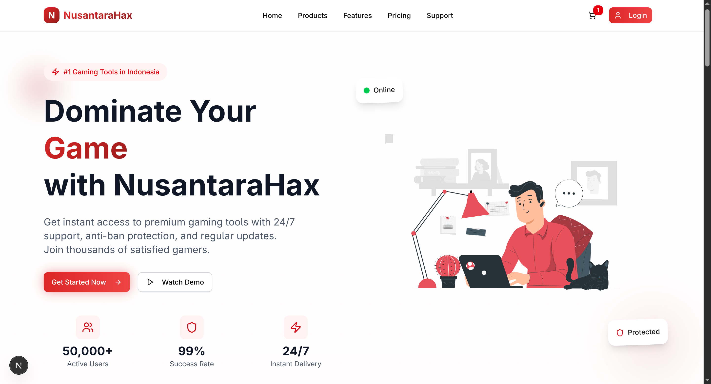

# 🎮 NusantaraHax - Premium Gaming Tools Website



A modern, responsive website for NusantaraHax gaming tools built with Next.js 15, featuring a stunning red-white theme, smooth animations, and premium user experience.

## ✨ Features

- **🎨 Modern Design**: Clean red-white theme with gradient effects
- **⚡ Smooth Animations**: Framer Motion powered animations and transitions
- **📱 Responsive**: Mobile-first design that works on all devices
- **🚀 Performance**: Optimized with Next.js 15 and Tailwind CSS v4
- **🛡️ Type Safe**: Full TypeScript support with strict typing
- **🎯 SEO Optimized**: Meta tags, Open Graph, and structured data
- **🔧 Developer Experience**: ESLint, Prettier, and modern tooling

## 🛠️ Tech Stack

### Frontend
- **Framework**: Next.js 15 (App Router)
- **Styling**: Tailwind CSS v4 + Custom CSS
- **Animation**: Framer Motion
- **UI Components**: Shadcn/ui (customized for red theme)
- **Icons**: Lucide React
- **Language**: TypeScript

### Backend & Database (Planned)
- **API**: Next.js API Routes
- **Database**: MySQL + Prisma ORM
- **Authentication**: NextAuth.js
- **Payment**: Duitku Integration
- **File Storage**: Local Storage

## 🚀 Quick Start

### Prerequisites

- Node.js 18+
- npm, yarn, or pnpm

### Installation

1. **Clone the repository**
   ```bash
   git clone https://github.com/prassaaa/nusantarahax-web.git
   cd nusantarahax-web
   ```

2. **Install dependencies**
   ```bash
   npm install
   # or
   yarn install
   # or
   pnpm install
   ```

3. **Setup Database (MySQL)**
   ```bash
   # Create MySQL database
   mysql -u root -p -e "CREATE DATABASE nusantarahax CHARACTER SET utf8mb4 COLLATE utf8mb4_unicode_ci;"

   # Configure environment variables
   cp .env.example .env
   # Edit .env and update DATABASE_URL with your MySQL credentials

   # Setup database schema
   npm run db:generate
   npm run db:push
   npm run db:seed
   ```

4. **Run the development server**
   ```bash
   npm run dev
   # or
   yarn dev
   # or
   pnpm dev
   ```

5. **Open your browser**
   Navigate to [http://localhost:3000](http://localhost:3000)

## 📁 Project Structure

```
src/
├── app/                    # Next.js App Router
│   ├── globals.css        # Global styles with custom theme
│   ├── layout.tsx         # Root layout with metadata
│   └── page.tsx           # Homepage
├── components/            # React components
│   ├── ui/               # Shadcn/ui base components
│   ├── layout/           # Layout components (Header, Footer)
│   ├── sections/         # Page sections (Hero, Features)
│   ├── common/           # Reusable components
│   └── forms/            # Form components
├── lib/                  # Utility libraries
│   ├── constants/        # App constants and config
│   ├── utils.ts          # Utility functions
│   ├── auth/             # Authentication utilities
│   ├── db/               # Database utilities
│   └── validations/      # Form validation schemas
├── hooks/                # Custom React hooks
├── types/                # TypeScript type definitions
├── styles/               # Additional CSS files
└── assets/               # Static assets
    ├── images/           # Image files
    └── icons/            # Icon files
```

## 🎨 Design System

### Color Palette
```css
/* Primary Colors */
--primary-red: #DC2626      /* Red-600 */
--primary-dark: #991B1B     /* Red-800 */
--primary-light: #FCA5A5    /* Red-300 */

/* Neutral Colors */
--white: #FFFFFF
--off-white: #F9FAFB        /* Gray-50 */
--dark-gray: #1F2937        /* Gray-800 */
--light-gray: #6B7280       /* Gray-500 */
```

### Gradients
- **Hero**: `linear-gradient(135deg, #DC2626 0%, #991B1B 100%)`
- **Button**: `linear-gradient(90deg, #DC2626 0%, #EF4444 100%)`
- **Card**: `linear-gradient(145deg, #FFFFFF 0%, #F9FAFB 100%)`
- **Background**: `linear-gradient(180deg, #FFFFFF 0%, #FEF2F2 100%)`

### Typography
- **Primary Font**: Geist Sans
- **Mono Font**: Geist Mono
- **Headings**: Bold, red gradient text
- **Body**: Clean, readable gray text

## 🎭 Animation System

### Page Transitions
```javascript
const pageTransition = {
  initial: { opacity: 0, y: 20 },
  animate: { opacity: 1, y: 0 },
  exit: { opacity: 0, y: -20 },
  transition: { duration: 0.3 }
}
```

### Interactive Elements
- **Button Hover**: Scale + red glow effect
- **Card Hover**: Lift + shadow animation
- **Loading States**: Skeleton pulses and spinners
- **Scroll Animations**: Reveal on viewport entry

## 📱 Responsive Design

### Breakpoints
- **Mobile**: < 768px (1 column layout)
- **Tablet**: 768px - 1024px (2 column layout)
- **Desktop**: > 1024px (3-4 column layout)

### Mobile Features
- Hamburger navigation menu
- Touch-optimized interactions
- Optimized image loading
- Simplified layouts

## 🔧 Development

### Available Scripts

```bash
# Development
npm run dev          # Start development server
npm run build        # Build for production
npm run start        # Start production server
npm run lint         # Run ESLint

# Database Operations
npm run db:generate  # Generate Prisma client
npm run db:push      # Push schema to database (development)
npm run db:migrate   # Run database migrations (production)
npm run db:seed      # Populate database with sample data
npm run db:studio    # Open Prisma Studio (database GUI)
```

### Code Style

- **ESLint**: Configured with Next.js recommended rules
- **TypeScript**: Strict mode enabled
- **Prettier**: Auto-formatting on save
- **Conventions**:
  - Use `kebab-case` for file names
  - Use `PascalCase` for components
  - Use `camelCase` for functions and variables

## 🚀 Deployment

### Vercel (Recommended)
1. Push your code to GitHub
2. Connect your repository to Vercel
3. Deploy automatically on every push

### Manual Deployment
```bash
npm run build
npm run start
```

## 🔮 Roadmap

### Phase 1: Foundation ✅
- [x] Project setup with Next.js 15
- [x] Design system implementation
- [x] Basic layout components
- [x] Hero section with animations

### Phase 2: Core Features 🚧
- [ ] Product catalog with filtering
- [ ] User authentication system
- [ ] Shopping cart functionality
- [ ] Payment integration (Duitku)

### Phase 3: Advanced Features 📋
- [ ] User dashboard
- [ ] License management
- [ ] Admin panel
- [ ] Analytics integration

### Phase 4: Optimization 📋
- [ ] Performance optimization
- [ ] SEO improvements
- [ ] A/B testing
- [ ] Mobile app (React Native)

## 🤝 Contributing

1. Fork the repository
2. Create a feature branch (`git checkout -b feature/amazing-feature`)
3. Commit your changes (`git commit -m 'Add amazing feature'`)
4. Push to the branch (`git push origin feature/amazing-feature`)
5. Open a Pull Request

### Development Guidelines
- Follow the existing code style
- Write meaningful commit messages
- Add tests for new features
- Update documentation as needed

## 📄 License

This project is licensed under the MIT License - see the [LICENSE](LICENSE) file for details.

## 🙏 Acknowledgments

- **Next.js Team** - For the amazing framework
- **Tailwind CSS** - For the utility-first CSS framework
- **Framer Motion** - For smooth animations
- **Shadcn/ui** - For beautiful UI components
- **Vercel** - For hosting and deployment

## 📞 Support

- **Email**: support@nusantarahax.com
- **Discord**: [Join our community](https://discord.gg/nusantarahax)
- **Documentation**: [docs.nusantarahax.com](https://docs.nusantarahax.com)

---

<div align="center">
  <p>Made with ❤️ for Indonesian gamers</p>
  <p>© 2025 NusantaraHax. All rights reserved.</p>
</div>
